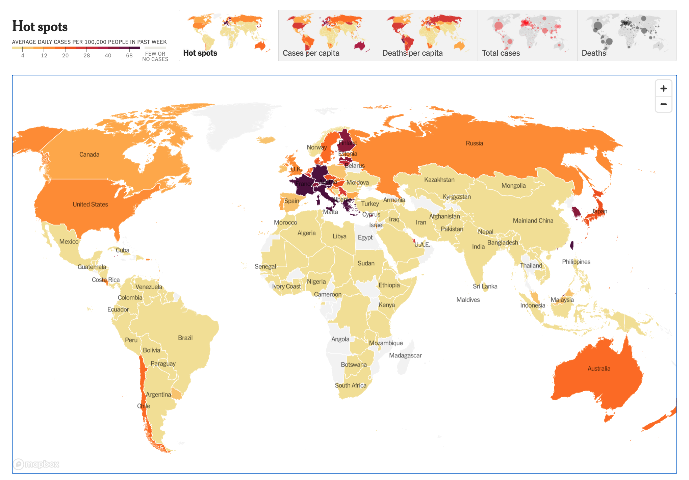

# A1: A Hot Hot Spots Map


### About the Author
This paper is written by Justin Young Dong. His email is jyd7@uw.edu, and it was published in October 2022.

### Finding a Visualization
I found my data visualization by browsing for COVID-19 data on the [New York Times](https://www.nytimes.com/interactive/2021/world/covid-cases.html). I have helped with developing a website in the past that compiled data related to the virus before, so I thought it would be interesting to see some more visualizations related to the subject. The New York Times has multiple cool visualizations, out of which I chose the **hot spots map** due to how visually appealing it looks and versatile it is. The visualization is able to convey general data at a glance with colorful displays, yet when you hover over specific territories it is also able to provide more in-depth data.

### What are Hot Spots Maps?
The hot spots map I chose shows the average daily COVID-19 cases per 100,000 people in countries around the world. Countries are shaded in based on a **color code** that ranges from the following colors (measured in daily cases per 100,000 people):
1. **Gray** - Few to no daily cases
2. **Light Orange** - 3 to 12 cases
3. **Orange** - 12 to 20 cases
4. **Dark Orange** - 20 to 28 cases
5. **Red** - 28 to 40 cases
6. **Dark Red** - 40 to 68 cases
7. **Brown** - More than 68 cases

Through the hot spots map, users can see how different regions are doing with new COVID cases. For more specific information, users can also **hover** over the individual countries for the specific number of new cases per day and a _14-day_ trend line.

### Some Hot Facts
**Who**: The COVID-19 Hot Spots Map uses population data from the _World Bank_, and was made by a team of data analysts at the _New York Times_.

**Date**: The map was last updated 10/9/2022 and is updated _**daily**_.

**Stakeholders**: The stakeholders for this piece of data visualization can be (but are not limited to) any of the following:
- **World Leaders** - Can use the map to view how their countries are doing in combatting the virus, and see how other countries are making progress
- **Public Health** - Public health officials can use data such as the 14 day trend line to see whether the virus is spreading or declining
- **Tourists** - Tourists can use the map to calculate the risk of traveling to certain countries

**Interests**: ​​The main goal achieved with this visualization is to spread information about how the world is progressing through the virus. By informing the public, people can make more educated choices regarding how they handle the virus such as wearing masks or planning travels.


**Key fact**: Something that can be learned by the visualization is how each country is doing with regards to new daily cases. I think one general trend that is interesting is that it seems like countries with stricter COVID-19 distancing regulations have lighter colors than countries that haven't. For example, China which enforces a really strict policy regarding virus has a lighter color than the United States, which varies but consists of plenty of states that do not have strict distancing regulations. I think it is important to note that the data given could be unreliable, as each country is responsible for reporting their own covid cases.

### Data Feminism: What I learned?
The definition of data feminism is quoted on page 10 as:

```
data feminism: a way of thinking
about data and its communication that
is informed by direct experience, by
a commitment to action, and by the
ideas associated with intersectional
feminist thought.
```
Reading about the idea of data feminism has helped realized the COVID hot spots map I found very broadly _**generalizes**_ populations :earth_americas:. The data is presented by countries as a whole, and fails to account for communities and groups within those countries. For example, an [academic article](https://academic.oup.com/cid/article/72/4/703/5860249) found online outlines how minority groups are affected _disproportionately_ by the effects of COVID-19. This is not shown in the hot spot maps, and instead the map may allow people to assume COVID-19 is impacting all people in a certain country the same way. Segmenting data further would be a start in alleviating this issue. 
